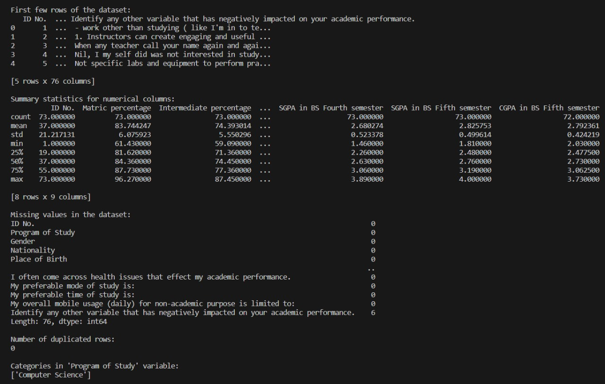
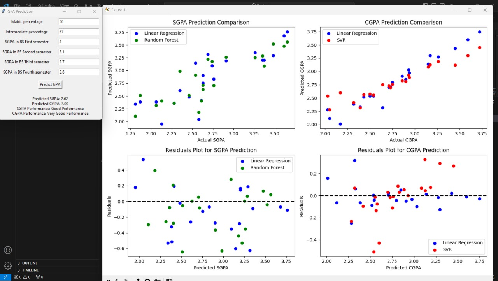

<!DOCTYPE html>
<html>

<head>

</head>

<body>

  <h1>GPA Prediction Project</h1>

  
This comprehensive project aims to predict Grade Point Averages (GPA) for the fifth semester of a university program based on various input features. The project is structured into three main components: Data Preprocessing, Exploratory Data Analysis (EDA), and a Graphical User Interface (GUI) for GPA prediction using machine learning models.

  <h2>1. Data Preprocessing</h2>

  <h3>Files</h3>
  <ul>
    <li><code>PreProcessing.py</code></li>
    <li><code>DataSet.xlsx</code></li>
  </ul>

  <h3>Description</h3>
  
The <code>PreProcessing.py</code> script employs data preprocessing techniques to ensure the dataset is suitable for machine learning analysis. Techniques include:

  <ul>
    <li>Reading the dataset from 'DataSet.xlsx'</li>
    <li>Cleaning column names by removing leading and trailing whitespaces</li>
    <li>Handling missing values using scikit-learn's <code>SimpleImputer</code> with the mean strategy</li>
    <li>Selecting relevant features for training</li>
    <li>Splitting the dataset into training and testing sets using <code>train_test_split</code></li>
    <li>Standardizing the features using scikit-learn's <code>StandardScaler</code></li>
  </ul>

  <h2>2. Exploratory Data Analysis (EDA)</h2>

  <h3>Files</h3>
  <ul>
    <li><code>EDA.py</code></li>
    <li><code>DataSet.xlsx</code></li>
  </ul>

  <h3>Description</h3>
  
The <code>EDA.py</code> script focuses on exploratory data analysis to understand the dataset and identify patterns. Techniques include:

  <ul>
    <li>Generating descriptive statistics for numerical columns</li>
    <li>Creating count plots for categorical variables using <code>seaborn</code></li>
    <li>Visualizing the distribution of numerical variables through histograms and scatter plots</li>
    <li>Assessing model performance with evaluation metrics such as mean squared error and R^2 score</li>
    <li>Plotting comparison and evaluation results through scatter plots and residuals plots</li>
  </ul>

  <h2>3. GPA Prediction GUI</h2>

  <h3>Files</h3>
  <ul>
    <li><code>main.py</code></li>
    <li><code>DataSet.xlsx</code></li>
  </ul>

  <h3>Description</h3>
  
The <code>main.py</code> script builds a graphical user interface (GUI) using Tkinter for predicting GPA based on user input. Key features include:

  <ul>
    <li>Entry boxes for users to input relevant features</li>
    <li>Buttons for predicting GPA and displaying results</li>
    <li>Utilizing trained machine learning models (not included in this snippet) for predictions</li>
    <li>Visualizing comparison and evaluation results through scatter plots and residuals plots</li>
  </ul>

  <h2>Instructions for Running the Project</h2>

  <ol>
    <li><strong>Install Required Libraries:</strong> Ensure you have the necessary Python libraries installed: pandas, numpy, matplotlib, seaborn, scikit-learn, and Tkinter.</li>
    <li><strong>Download Dataset:</strong> Download the <code>DataSet.xlsx</code> file and place it in the same directory as the Python scripts.</li>
    <li><strong>Run Data Preprocessing:</strong> Execute <code>PreProcessing.py</code> to preprocess the dataset.</li>
    <li><strong>Explore Data:</strong> Run <code>EDA.py</code> to perform exploratory data analysis and gain insights.</li>
    <li><strong>Train Machine Learning Models:</strong> Train machine learning models using a separate script (not included in this snippet).</li>
    <li><strong>Run GPA Prediction GUI:</strong> Execute <code>main.py</code> to use the GUI for GPA prediction.</li>
  </ol>

  

</body>

</html>
